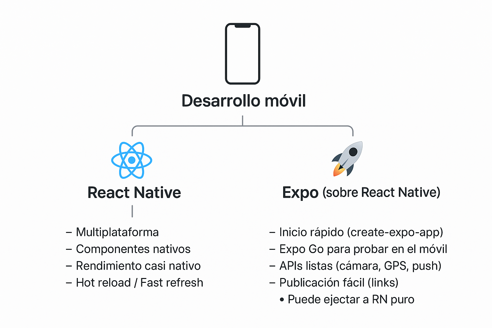

> PROGRAMACIÓN MULTIMEDIA Y DISPOSITVOS MÓVILES

# Tema 1: TECNOLOGÍAS DE DESARROLLO PARA DISPOSITIVOS MÓVILES <!-- omit in toc -->
> Ánalisis de tecnologías disponibles para el desarrollo para móvil  
> CONCEPTOS


- [1. Introducción](#1-introducción)
- [2. Tecnologías de desarrollo para dispositivos móviles](#2-tecnologías-de-desarrollo-para-dispositivos-móviles)
  - [2.1. Desarrollo Nativo](#21-desarrollo-nativo)
  - [2.2. Frameworks Multiplataforma](#22-frameworks-multiplataforma)
  - [2.3. Aplicaciones Híbridas (Web en contenedor)](#23-aplicaciones-híbridas-web-en-contenedor)
  - [2.4. Progressive Web Apps (PWA)](#24-progressive-web-apps-pwa)
  - [2.5. Comparación Rápida](#25-comparación-rápida)
- [3. Introdución a React Native y Expo](#3-introdución-a-react-native-y-expo)
  - [3.1. React Native](#31-react-native)
  - [3.2. Expo](#32-expo)
- [4. Crear nuevo proyecto con expo](#4-crear-nuevo-proyecto-con-expo)
  - [4.1. Plantillas](#41-plantillas)
  - [4.2. Ejemplos](#42-ejemplos)
- [5. Construir el proyecto (Build)](#5-construir-el-proyecto-build)
  - [5.1. Plataformas](#51-plataformas)
  - [5.2. Perfiles](#52-perfiles)
- [6. Referencias](#6-referencias)


---


# 1. Introducción


# 2. Tecnologías de desarrollo para dispositivos móviles

## 2.1. Desarrollo Nativo
- **Plataformas:** Android (Java/Kotlin), iOS (Swift/Objective-C).  
- **Características:**
  - Máxima integración con el hardware.
  - Mejor rendimiento y eficiencia energética.
  - Acceso inmediato a nuevas APIs.  
- **Capacidades:**
  - Ideal para apps con alto uso de gráficos (juegos, AR/VR).
  - Mejor experiencia de usuario (UI/UX fluida).
  - Requiere equipos especializados por plataforma.


## 2.2. Frameworks Multiplataforma
- **Ejemplos:** React Native, Flutter, Xamarin, Kotlin Multiplatform, .NET MAUI.  
- **Características:**
  - Código único para Android e iOS.
  - Menor tiempo y costo de desarrollo.
  - Gran comunidad y librerías disponibles.  
- **Capacidades:**
  - Buen rendimiento (aunque menor que nativo).
  - Acceso a APIs nativas mediante plugins.
  - Adecuados para apps empresariales, e-commerce y prototipos rápidos.


## 2.3. Aplicaciones Híbridas (Web en contenedor)
- **Ejemplos:** Ionic, Apache Cordova, Capacitor.  
- **Características:**
  - Basadas en HTML, CSS y JavaScript.
  - Ejecutadas dentro de un contenedor nativo (WebView).  
- **Capacidades:**
  - Desarrollo rápido para apps simples.
  - Rendimiento inferior al nativo y multiplataforma.
  - Acceso limitado al hardware.


## 2.4. Progressive Web Apps (PWA)
- **Basadas en:** Tecnologías web estándar + Service Workers.  
- **Características:**
  - No requieren instalación desde tienda.
  - Compatibles con navegadores modernos.
  - Funcionan offline en ciertos casos.  
- **Capacidades:**
  - Útiles para apps informativas o de servicios básicos.
  - Limitaciones en funciones avanzadas (sensores, Bluetooth, notificaciones push en iOS).


## 2.5. Comparación Rápida

| Tecnología          | Rendimiento | Acceso a Hardware  | Coste/tiempo | Experiencia de usuario |
| ------------------- | ----------- | ------------------ | ------------ | ---------------------- |
| **Nativo**          | ⭐⭐⭐⭐⭐       | Completo           | Alto         | Excelente              |
| **Multiplataforma** | ⭐⭐⭐⭐        | Alto (con plugins) | Medio        | Muy buena              |
| **Híbridas**        | ⭐⭐          | Medio              | Bajo         | Aceptable              |
| **PWA**             | ⭐⭐          | Limitado           | Muy bajo     | Básica                 |


# 3. Introdución a React Native y Expo


## 3.1. React Native

React Native es un **framework de desarrollo móvil creado por Meta (Facebook)** que permite construir aplicaciones **nativas para iOS y Android usando JavaScript y React**.

En lugar de renderizar en el navegador (como hace React para web), React Native traduce los componentes de React a **componentes nativos** de cada plataforma (por ejemplo, `View` se convierte en un `UIView` en iOS y en un `View` en Android).

✅ Ventajas de React Native:

* **Código multiplataforma:** escribes una sola base de código (en JS/TS) y funciona en iOS y Android.
* **Rendimiento cercano al nativo:** no usa un navegador como Cordova, sino que se conecta al sistema nativo.
* **Gran comunidad y librerías:** muy usado en startups y empresas grandes (Airbnb, Instagram, Tesla, etc.).
* **Hot Reload / Fast Refresh:** ves cambios de código en tiempo real sin recompilar toda la app.


## 3.2. Expo

Expo es un **conjunto de herramientas y servicios** construido sobre React Native que facilita el desarrollo, prueba y publicación de apps.

Se puede pensar como una “capa” encima de React Native que simplifica el proceso, especialmente al inicio.

✅ Ventajas de Expo:

* **Sin configuración inicial complicada:** puedes crear una app con un solo comando (`npx create-expo-app`).
* **Expo Go:** una app que instalas en tu móvil para probar tus proyectos al instante, sin necesidad de compilar en Xcode o Android Studio.
* **APIs listas para usar:** cámara, notificaciones push, sensores, archivos, etc., sin instalar librerías nativas extra.
* **Publicación rápida:** puedes compartir tu app con un link sin tener que generar un APK/IPA al inicio.

⚠️ Limitaciones de Expo (en proyectos sin “Eject”):

* Si necesitas código **nativo muy personalizado**, Expo puede quedarse corto.
* Aunque cada vez soporta más librerías nativas, en algunos casos toca “ejectar” (pasar a un proyecto React Native “puro”).


📌 **En resumen**:

* **React Native** = framework para crear apps móviles nativas con JavaScript/React.
* **Expo** = herramienta que hace más fácil empezar y trabajar con React Native, evitando configuraciones complicadas.



# 4. Crear nuevo proyecto con expo

```sh
npx  create-expo-app@latest  nombre-proyecto
```

> [!NOTE]  
> **Prerequisitos:**  
> - Tener instalado Node.js (node, npm, npx)


## 4.1. Plantillas

Podemos crear un proyecto nuevo con código de ejemplo con la opción [**`--template`**](https://docs.expo.dev/more/create-expo/#--template)

Por ejemplo:

```sh
npx   create-expo-app   --template blank
```

Las plantillas disponibles son:

- **default**  
  Plantilla predeterminada. Diseñada para construir aplicaciones con múltiples pantallas. Incluye herramientas recomendadas como Expo CLI, la librería Expo Router y la configuración de TypeScript habilitada. Adecuada para la mayoría de las aplicaciones.

- **blank**  
  Instala las dependencias mínimas requeridas de npm sin configurar la navegación.

- **blank-typescript**  
  Una plantilla en blanco con TypeScript habilitado.

- **tabs**  
  Instala y configura el enrutamiento basado en archivos con Expo Router y TypeScript habilitado.

- **bare-minimum**  
  Una plantilla en blanco con directorios nativos (android y ios) generados. Ejecuta `npx expo prebuild` durante la configuración.


> [!TIP]
>
> - La plantilla **`blank`** es más adecuada para realizar una aplicaciones sencillas de una única pantalla.
> - La plantilla **`default`** es más adecuada para realizar una aplicaciones de una varias pantalla.


## 4.2. Ejemplos

Podemos crear un proyecto nuevo con código de ejemplo con la opción [**`--example`**](https://docs.expo.dev/more/create-expo/#--example)


Por ejemplo:

```sh
npx   create-expo-app   --example with-router
```

> [!NOTE]
>
> Ejemplos disponibles en https://github.com/expo/examples


# 5. Construir el proyecto (Build)

Podemos realizar el *build* para las siguientes plataformas:

- **Android**
- **IOS**
- **Web**
  
> [!NOTE]
>
> El *build* para IOS requiere de una cuenta de pago como desarrollador en la plataforma de Apple.

En adelante nos centraremos en la plataforma Android.

Expo nos proporciona un sistema en la nube para realizar la construcción de nuestras aplicaciones, conocido como EAS (Expo Application Services). Podemos registrarnos en https://expo.dev/eas. Actualmente (octubre 2025), con el plan gratuito podemos realizar 15 build para Android y otras 15 build para IOS.

Si sobrepasamos ese límite también podemos hacer *build* en nuestra propia computadora. Sigue leyendo más abajo.

Una vez registrados en la plataforma EAS, en nuestro ordenador gestionaremos el proceso de construcción de nuestra aplicación desde nuestro ordenador y usaremos la web para ver los *build* realizados y descargar los archivos resultantes.

En nuestra computadora, instalaremos el programa para interactuar con EAS.

```sh
npm install -g eas-cli
```

Una vez instalado, nos autenticaremos con las credenciales con las cuales realizamos el alta en EAS.

```sh
eas login
```

> [!NOTE]
>
> Observa que una vez instalado el paquete `eas-cli`, debemos usar el **comando `eas`**


Una vez realizado el login correctamente, **en cada proyecto** deberemos ejecutar:

```sh
eas  init
```

Esto permote inicializar y vincular el proyecto a EAS


## 5.1. Plataformas

Las plataformas soportadas son:

- `android`
- `ios`
- `web`


```sh
eas  build  --platform android
```

## 5.2. Perfiles

Existen 3 perfiles al generar el *build* en nivel creciente de refinamiento. Son:

- `development`
- `preview`
- `production`


```sh
eas  build  --platform android  --profile preview
```

> [!TIP]
>
> Si tenemos instalado Android Studio, podremos realizar una construcción en nuestro propia computadora. Para ello usaremos el *flag*  `--local`
>
> ```sh
> eas  build  --platform android  --profile preview  --local
> ```


# 6. Referencias

- [Tutorial EAS](https://docs.expo.dev/tutorial/eas/introduction/)